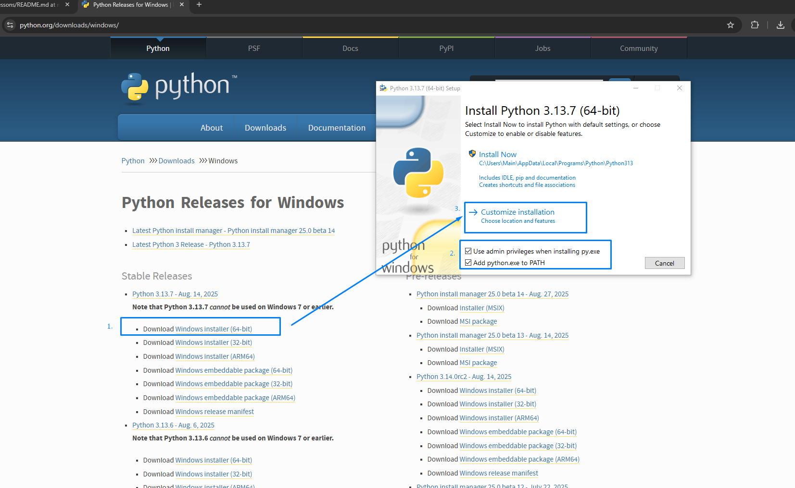
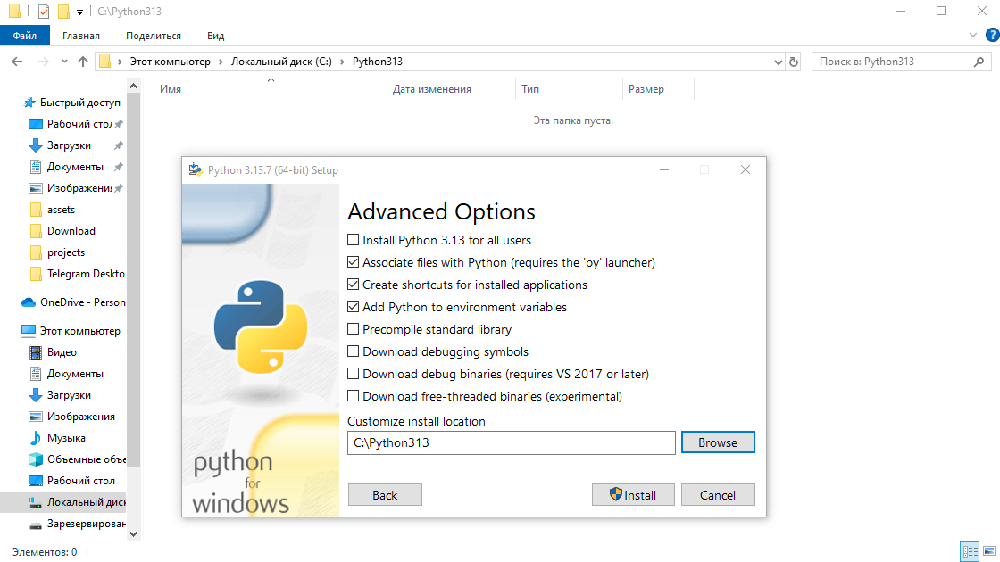
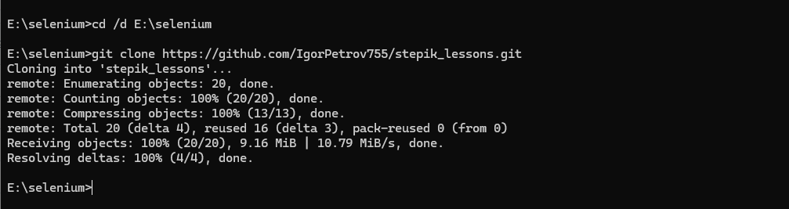
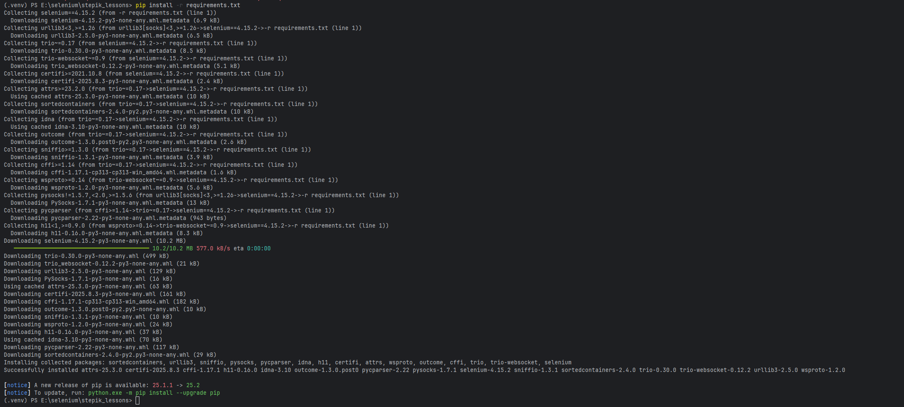
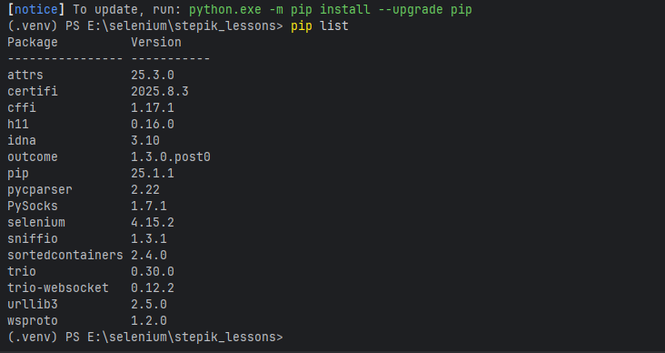
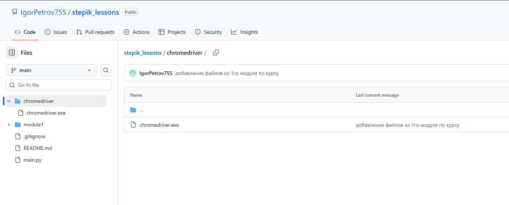
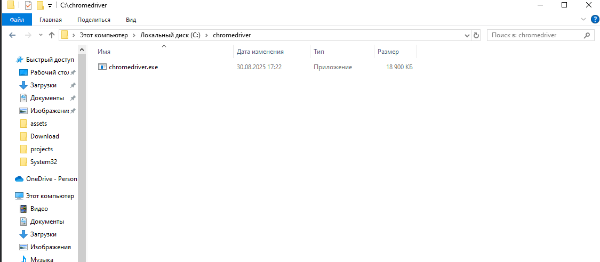

# 🚀 Инструкция по запуску Selenium кода на Python (Windows 10)

## 📋 Содержание

1. [Установка Python](#1-установка-python)
2. [Установка PyCharm (редактор кода)](#2-установка-pycharm-редактор-кода)
3. [Установка Git и клонирование репозитория](#3-установка-git-и-клонирование-репозитория)
4. [Создание виртуального окружения](#4-создание-виртуального-окружения)
5. [Установка зависимостей](#5-установка-зависимостей)
6. [Установка веб-драйвера](#6-установка-веб-драйвера)
7. [Запуск кода](#7-запуск-кода)
8. [Возможные проблемы и решения](#8-возможные-проблемы-и-решения)

---

## 1. Установка Python

### Шаг 1: Скачивание Python
1. Перейдите на официальный сайт: **[https://www.python.org/downloads/windows/](https://www.python.org/downloads/windows/)**
2. Нажмите на кнопку **"Download Windows installer (64-bit)"**
3. Скачайте файл с расширением `.exe` (python-3.13.7-amd64.exe)

### Шаг 2: Установка Python
1. **Запустите скачанный файл**
2. **ВАЖНО!** Внизу окна установщика поставьте галочки -
✅ **"Use admin privileges when installing py.exe"** - Это позволит запускать Python из командной строки
✅ **"Add python.exe to PATH"** - Это позволит запускать Python из командной строки
3. Нажмите **"Customize installation"** → **"Customize install location"**
  
4. Дождитесь завершения установки

### Шаг 3: Проверка установки
1. Нажмите **Win + R**, введите `cmd` и нажмите **Enter**
2. В командной строке введите:
   ```bash
   python --version
   ```
3. Должна появиться версия, например: `Python 3.12.0`

> ✅ **Если всё работает правильно**, переходите к следующему шагу.

### ⚠️ Возможная проблема: Несколько версий Python

Если команда `python --version` показывает старую версию Python, это означает, что у вас установлено несколько версий Python.

#### Проверка установленных версий Python
Выполните в командной строке (CMD или PowerShell):
```bash
where python
```
Эта команда покажет все пути, где лежит `python.exe`.

**Пример вывода:**
```
C:\Users\Имя\AppData\Local\Programs\Python\Python310\python.exe
C:\Users\Имя\AppData\Local\Programs\Python\Python312\python.exe
```

#### Изменение переменных окружения (PATH)

Чтобы по умолчанию использовалась новая версия:

1. Нажмите **Win + R** → введите `sysdm.cpl` → нажмите **Enter**
2. Перейдите на вкладку **"Дополнительно"**
3. Нажмите кнопку **"Переменные среды"**
4. В разделе **"Переменные среды пользователя"** или **"Системные переменные"** найдите переменную **"Path"**
5. Нажмите **"Изменить"**
6. В списке Path найдите строки с путём к старому Python (например, `Python310\`) и **удалите их**
7. **Добавьте** путь к новой версии (например, `C:\Python313\`)
8. Нажмите **"OK"** во всех окнах

#### Проверка результата
1. **Перезапустите терминал** (закройте и откройте командную строку заново)
2. Проверьте версию:
   ```bash
   python --version
   ```
3. Теперь должна показываться новая версия Python (Python 3.13.7)
---

## 2. Установка PyCharm (редактор кода)

### Шаг 1: Скачивание PyCharm
1. Перейдите на сайт: **[https://www.jetbrains.com/pycharm/download/?section=windows/](https://www.jetbrains.com/pycharm/download/?section=windows/)**
2. Скачайте **PyCharm Community Edition** (бесплатная версия)
3. Выберите версию для Windows

### Шаг 2: Установка PyCharm
1. Запустите скачанный файл
2. Следуйте инструкциям установщика
3. При первом запуске PyCharm может предложить импортировать настройки - выберите **"Do not import settings"**

### Шаг 3: Первый запуск
1. Примите лицензионное соглашение
2. Выберите тему (светлую или темную)
3. PyCharm готов к работе!

---

## 3. Установка Git и клонирование репозитория

### Шаг 1: Установка Git
1. Перейдите на сайт: **[https://git-scm.com/download/win](https://git-scm.com/download/win)**
2. Скачайте Git для Windows
3. Запустите установщик и следуйте инструкциям (можно оставить все настройки по умолчанию)

### Шаг 2: Проверка установки Git
1. Откройте командную строку (Win + R → cmd)
2. Введите:
   ```bash
   git --version
   ```
3. Должна появиться версия Git

### Шаг 3: Клонирование репозитория
1. Откройте командную строку (Win + R → cmd)
2. Перейдите в папку, где хотите создать (поместить) проект:
   ```bash
   cd /d E:\selenium
   ```
3. Склонируйте репозиторий:
   ```bash
   git clone https://github.com/IgorPetrov755/stepik_lessons.git
   ```
4. В выбранной папке появилась новая папка с названием **stepik_lessons**

---

## 4. Создание виртуального окружения

### Что такое виртуальное окружение?
Виртуальное окружение - это изолированная среда для Python проекта, которая позволяет устанавливать библиотеки отдельно от основной системы.

### Шаг 1: Открытие проекта в PyCharm
1. Запустите **PyCharm**
2. Выберите **"Open"**
3. Найдите и выберите папку **stepik_lessons** (склонированный репозиторий)
4. Нажмите **"OK"**

### Шаг 2: Создание виртуального окружения в PyCharm
1. После открытия проекта перейдите в **File** → **Settings** (или нажмите **Ctrl + Alt + S**)
2. В левой панели найдите **Python Interpreter**
3. В правой части окна выберите **Add Interpreter** → **Add Local Interpreter**
4. Выберите **"Add"**
5. В диалоговом окне **"Add Python Interpreter"** выберите:
   - **Environment** → **Generate new**
   - **Base PythonD**: выберите путь к Python (например, `C:\Python313\python.exe`)
   - **Location**: `E:\selenium\stepik_lessons\venv`
6. Нажмите **"OK"**

### Шаг 3: Проверка создания виртуального окружения
1. В левой панели PyCharm найдите папку **venv**
2. Внутри неё должны быть папки:
   - **Scripts** (содержит `python.exe`, `pip.exe` и другие файлы)
   - **Lib** (содержит установленные библиотеки)
3. Внизу окна PyCharm должна быть вкладка **Terminal** - это встроенный терминал с активированным виртуальным окружением

### Шаг 4: Проверка в терминале PyCharm
1. Откройте встроенный терминал PyCharm: **View** → **Tool Windows** → **Terminal**
2. В терминале должно быть `(venv)` в начале строки:
   ```
   (venv) E:\selenium\stepik_lessons>
   ```
3. Проверьте версию Python:
   ```bash
   python --version
   ```

> 💡 **Совет:** Встроенный терминал PyCharm автоматически активирует виртуальное окружение. Если вы открываете внешнюю командную строку, активируйте окружение командой `venv\Scripts\activate`

---

## 5. Установка зависимостей

### Вариант 1: Установка через requirements.txt (рекомендуется)

#### Шаг 1: Проверка файла requirements.txt
1. В папке проекта **stepik_lessons** должен быть файл `requirements.txt`
2. Откройте файл и проверьте его содержимое. Он должен содержать что-то вроде:
   ```
   selenium==4.15.2
   pytest==7.4.3
   ```

#### Шаг 2: Установка всех зависимостей
В активированном виртуальном окружении выполните:
```bash
pip install -r requirements.txt
```


#### Шаг 3: Проверка установки
```bash
pip list
```
Вы должны увидеть все установленные библиотеки из файла requirements.txt.


### Вариант 2: Ручная установка библиотек

Если файла `requirements.txt` нет или вы хотите установить библиотеки по отдельности:

#### Шаг 1: Установка Selenium
```bash
pip install selenium
```

#### Шаг 2: Проверка установки
```bash
pip list
```
Вы должны увидеть установленные библиотеки, включая `selenium`.

> 💡 **Совет:** Использование `requirements.txt` - это лучшая практика, так как все участники проекта будут использовать одинаковые версии библиотек.

---

## 6. Установка веб-драйвера

### Проверка версии Chrome
1. Откройте Chrome
2. Нажмите **⋮** (три точки) → **Справка** → **О браузере Google Chrome**
3. Номер версии хрома должен соответствовать версии chromedriver (сейчас это 139)

### Установка ChromeDriver
0. Можно взять из этого репозитория в папке chromedriver и перейти на пункт 4.


1. Перейдите на сайт: **[https://chromedriver.chromium.org/downloads](https://chromedriver.chromium.org/downloads)**
2. Скачайте версию, соответствующую вашему Chrome
3. Распакуйте файл `chromedriver.exe`
4. В корне диска С создайте папку chromedriver и скопируйте `chromedriver.exe` туда


#### Изменение переменных окружения (PATH)
1. Нажмите **Win + R** → введите `sysdm.cpl` → нажмите **Enter**
2. Перейдите на вкладку **"Дополнительно"**
3. Нажмите кнопку **"Переменные среды"**
4. В разделе **"Переменные среды пользователя"** или **"Системные переменные"** найдите переменную **"Path"**
5. Нажмите **"Изменить"**
6. **Добавьте** путь к chromedriver (`C:\chromedriver\`)
8. Нажмите **"OK"** во всех окнах
---

## 7. Запуск кода

### Шаг 1: Проверка интерпретатора Python
1. Убедитесь, что проект открыт в PyCharm и виртуальное окружение создано (см. раздел 4)
2. Проверьте, что используется правильный интерпретатор:
   - Перейдите в **File** → **Settings** (или **Ctrl + Alt + S**)
   - Выберите **Project: stepik_lessons** → **Python Interpreter**
   - Должен быть выбран интерпретатор из виртуального окружения:
     ```
     E:\selenium\stepik_lessons\venv\Scripts\python.exe
     ```

### Шаг 2: Обзор файлов в папке module1
В проекте есть папка `module1` с готовыми примерами кода для изучения Selenium:

- **`first_script.py`** - базовый пример работы с Selenium (открытие страницы, поиск элементов, ввод текста)
- **`lesson1_6.py`** - простой пример с обработкой ошибок (try/finally)
- **`lesson1_6_2.py`** - пример работы с формами
- **`lesson1_6_3.py`** - пример поиска элементов по разным селекторам
- **`lesson1_6_4.py`** - пример работы с кнопками
- **`lesson1_6_5.py`** - пример работы с текстовыми полями
- **`lesson1_6_6.py`** - продвинутый пример с множественными действиями

### Шаг 3: Запуск первого примера
Рекомендуется начать с файла `first_script.py`:

1. В PyCharm найдите папку **module1** в левой панели
2. Откройте файл **`first_script.py`**
3. Нажмите правой кнопкой на файл и выберите **"Run 'first_script'"**
4. Или нажмите **Shift + F10** когда файл открыт

> 🎉 **Что произойдет:** Откроется Chrome, перейдет на страницу с формой, введет ответ "get()" и нажмет кнопку отправки.

### Шаг 4: Запуск других примеров
После успешного запуска первого примера можете изучать остальные файлы:

1. **`lesson1_6.py`** - простой пример с обработкой ошибок
2. **`lesson1_6_2.py`** - работа с формами
3. **`lesson1_6_3.py`** - поиск элементов по ID, CSS, XPath
4. И так далее...

### Шаг 5: Создание собственного теста
Когда освоите примеры, можете создать свой файл:

1. В PyCharm правой кнопкой на папку **module1** → **New** → **Python File**
2. Назовите файл, например, `my_test.py`
3. Используйте структуру из примеров:

```python
import time
from selenium import webdriver
from selenium.webdriver.common.by import By

try:
    # Ваш код здесь
    driver = webdriver.Chrome()
    driver.get("https://example.com")
    
    # Поиск и взаимодействие с элементами
    element = driver.find_element(By.CSS_SELECTOR, "selector")
    element.click()
    
    time.sleep(3)  # Пауза для наблюдения
    
finally:
    # Всегда закрываем браузер
    driver.quit()
```

> 💡 **Совет:** Изучайте примеры по порядку - от простых к сложным. Каждый файл демонстрирует новые возможности Selenium.

---

## 8. Возможные проблемы и решения

### Проблема: "python не является внутренней или внешней командой"
**Решение:** Python не добавлен в PATH. Переустановите Python с галочкой "Add Python to PATH".

### Проблема: Команда `python --version` показывает старую версию
**Решение:** У вас установлено несколько версий Python. Выполните:
```bash
where python
```
Это покажет все установленные версии. Затем измените переменную PATH:
1. Win + R → `sysdm.cpl` → вкладка "Дополнительно" → "Переменные среды"
2. Найдите переменную "Path" → "Изменить"
3. Удалите пути к старой версии Python
4. Добавьте путь к новой версии
5. Перезапустите терминал

### Проблема: "Chrome version mismatch"
**Решение:** Обновите Chrome до последней версии или скачайте соответствующую версию ChromeDriver.

### Проблема: "Permission denied" при активации venv
**Решение:** Запустите командную строку от имени администратора.

### Проблема: PyCharm не видит установленные библиотеки
**Решение:** Проверьте, что в PyCharm выбран правильный интерпретатор Python (из виртуального окружения).

---

## 📚 Полезные ссылки

- **[Официальная документация Selenium](https://selenium-python.readthedocs.io/)**
- **[Selenium WebDriver для Python](https://pypi.org/project/selenium/)**
- **[ChromeDriver Downloads](https://chromedriver.chromium.org/downloads)**
- **[PyCharm Documentation](https://www.jetbrains.com/help/pycharm/)**
- **[Git Documentation](https://git-scm.com/doc)**

---
